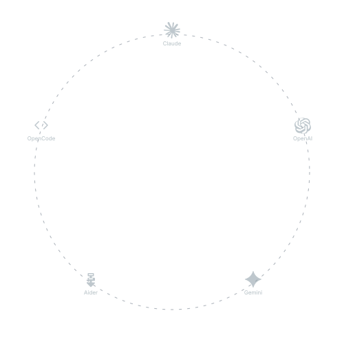

<p align="center">
  
</p>

<h1 align="center">Karajan Code</h1>

<p align="center">
  The environment that governs AI-driven development — your agent orchestrates, Karajan governs.
</p>

<p align="center">
  <a href="https://www.npmjs.com/package/karajan-code"></a>
  <a href="https://www.npmjs.com/package/karajan-code"></a>
  <a href="https://github.com/manufosela/karajan-code/actions"></a>
  <a href="https://www.gnu.org/licenses/agpl-3.0"></a>
  <a href="https://nodejs.org"></a>
</p>

<p align="center">
  <a href="docs/README.es.md">Leer en Español</a> · <a href="https://karajancode.com">Documentation</a> · <a href="https://planning-game-xp.web.app/public/?project=Karajan%20Code">Public roadmap</a>
</p>

---

Your AI agent (Claude Code, Codex, Gemini CLI, Cursor…) writes the code. **Karajan governs how it happens**: it installs a method your agent follows on every task, and enforces it with git gates that make a false green structurally impossible.

- **RAG before assuming** — `kj rag query` answers what your codebase does; no agent guesses. Works out of the box: local Ollama, or the built-in ONNX embedder when nothing can be installed; cloud embedders require an explicit sensitivity declaration and PII-redact every chunk.
- **Card first, on YOUR board** — every piece of work is tracked before it starts: kj's HU Board (`kj hu add|move|list`), the Planning Game, or the board the project already uses (Linear, Trello, Jira, GitHub Issues) via your agent's own MCP/tools. Declared, verified at install, never optional — Karajan does not run without a board. ADRs live in git (`kj adr add|list`).
- **Tests prove behavior** — the failing test exists first; the suite is never left red.
- **Deterministic first, then cross-AI review** — `kj review --staged` runs SonarQube on the changed files before any AI opinion (BLOCKER/CRITICAL reject on the spot), then binds a verdict from a *different* AI to the sha256 of the exact diff — stamped with the workspace it ran from. Without an approved verdict, **the commit does not enter** (pre-commit gate).
- **A third AI arbitrates disputes** — `kj solomon` rules when brain and reviewer disagree. Security findings are never overridable — not even by arbitration.
- **Branch first, lanes for parallel work** — the base branch only moves through atomic PRs; `kj worktree start|list|done` gives each concurrent task its own isolated lane.

This repo runs under its own environment: every commit to karajan-code carries a cross-AI verdict.

## Install

Tell your agent — in the directory where you want to work:

```text
I want to use Karajan in this project: read https://karajancode.com/start.md
and do what it says.
```

The router prompt installs the full stack if needed, detects new vs existing project, activates the environment, and **stops to wait for you** whenever a step needs sudo or an account (`kj` exit code 3 = pending user action — a partial install is a failed install).

Manual equivalent:

```sh
curl -fsSL https://karajancode.com/install.sh | sh   # full product (npm-first; --standalone for CLI-only)
kj doctor && kj install-tools                        # complete the stack
kj init && kj env install && kj harden && kj review --install-gate
git config core.hooksPath .karajan/hooks
```

Requires git and at least one AI agent CLI — two enables cross-AI review; three enables arbitration. All install routes (npm, binaries, brew, Python wrapper) in the [install docs](https://karajancode.com/docs/v4/install/).

## The daily loop

1. You describe what you want. Your agent creates the card (`kj hu add`), queries the RAG, writes the failing test, then the code.
2. `kj review --staged` — a different AI reviews the exact diff. Approved → commit enters. Rejected → fix, or escalate to `kj solomon`.
3. Atomic PR to the base branch. `kj report` shows the trail; the HU Board (`kj board`) shows the work.
4. Your agent hits a kj bug? `kj report-issue` files it upstream — sanitized, deduped, and only with your approval. The ecosystem repairs itself.

Full method: [Work with your agent](https://karajancode.com/docs/v4/working-with-your-agent/) · [The gates](https://karajancode.com/docs/v4/gates/) · [Command reference](https://karajancode.com/docs/v4/commands/).

## Headless mode

The classic multiagent pipeline lives on for CI and automation: `kj run "<task>"` orchestrates coder/reviewer/tester subprocess roles unattended, with the same gates. Agents and CI pass `--non-interactive` (or `KJ_NON_INTERACTIVE=1`): safe gates auto-answer, FAIL findings stop the run with a real exit code. `kj advanced` lists the full surface. [Headless mode docs](https://karajancode.com/docs/v4/headless/).

## v3 (historical)

Karajan v1–v3 was a headless multiagent pipeline driven entirely by subprocess orchestration. Its full story — pipeline, 24 roles, MCP server, step mode, parallel lanes — is preserved in the **[v3 README (historical archive)](docs/README.v3.md)** and the [v3 docs archive](https://karajancode.com/docs/getting-started/introduction/).

## Contributing & license

Issues and PRs welcome — friction reports via `kj report-issue` are especially valuable. Licensed under [AGPL-3.0](LICENSE).
